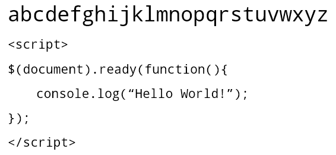
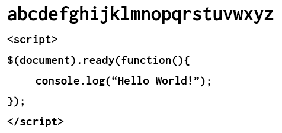

Choosing the coding font that suits your style is a difficult job. It has to impress you with it's curves, spaces and visual aesthetics. For me, there are these specific things that mattered the most.

- Sharpness - How distinctively each letter can be seen when there is a lot of code.
- Space - How much of space a letter utilizes.
- Visual Impression - How appealing a font looks with minimalism.

I work on a Windows PC and on a medium resolution monitor( 1366 X 768 ). I use [Sublime Text 3](http://www.sublimetext.com/3).

At this resolution text does not seem to look smooth. I have seen how "Arial" looks like on a mac and on my PC. I generally work with **11pt**. So I knew that whatever font I choose, it should look good on my monitor with the low resolution.

Now there are no ways to settle on a font unless you try them... and I tried a lot of them. Here goes my list.

**[Andale Mono](https://github.com/uarun/dotfiles/blob/master/fonts/Andale-Mono.ttf) **

This was the first font I used after I was done with default "Consolas". I still like it. The problem was that it did not perform well in smaller font sizes with my monitor. I liked the sharpness though. It's also simple and minimal. Here's how it looks.

**[DejaVu Sans Mono](http://dejavu-fonts.org/wiki/Main_Page)**

After using Andale Mono for long, I wanted to try something new. I settled down to this one for some time. The bad? it looked wider than I would expect it to be at lower font sizes. Also, it didn't just fit my eyes when tested with different programming languages. I used it primarily because of the sharpness factor.

[**Droid Sans Mono**](https://www.google.com/fonts/specimen/Droid+Sans)

Then came this. It was crisp, a little less than DejaVu Sans Mono but acceptable. But it solved the space problem I had with the previous one. It scaled well for smaller and larger font sizes and became my friend for long. _Bonus - it's less curvy._

**[Fira](http://www.carrois.com/fira-3-1/)**

I was still using Droid Sans but I was getting bored. It was time when I heard about Fira coming out as [Firefox OS Typeface](https://www.mozilla.org/en-US/styleguide/products/firefox-os/typeface/). I was excited and gave it a try. Sadly, it never suited my style. It just didn't feel right. I fell back to Droid Sans Mono. Plus, the letters "r" or "j", they specifically looked too bad and congested in smaller font sizes.

[**Monaco**](https://github.com/todylu/monaco.ttf)

This was one of those fonts which I saw at a lot of places on web. It's the default monospace font for mac and I could see why it's popular. It's different by design, has lot of breathing space, and performed well in lower resolutions. I love it. But I have never been able to settle down to it as my default coding font. Something kept me away from that.

May be on a different system, I will give it another try.

[**Inconsolata**](https://www.google.com/fonts/specimen/Inconsolata)

Then one fine day I found this. I had heard about Inconsolata before but never gave it a try. But once I did, I stopped imagining my way back to any other font. It made my code look beautiful. It has the right amount of sharpness and size I require. It scales extremely well with smaller and higher font sizes. I fell in love. <3

I use Inconsolata for coding everywhere now. I use it even for plain text. It's brilliant. Even on web, this particular font renders much better than any coding font I have ever used.

I have made it a point to recommend it to people who love coding.
