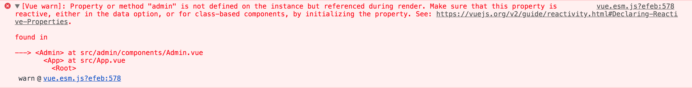

...and Angular is not.

**Disclaimer** - These are my personal thoughts AFTER using both of them to solve real world use cases. Nothing too fancy but nothing too simple.

I have been using Angular 2( or 4, 5 ...), now called just Angular, for more than a year now. I don't hate it but I don't like it at all. Not my thing. At work, I am still required to use it but that's about it. If I am asked to choose a framework to build something new, it won't be my choice.

I liked Angular JS( Angular 1.x ) a lot. I know the performance problems it had( has ). I was THE person in my company who was excited about the next iteration(...turned out to be an incarnation) of Angular to see what the team comes up with. Alas, I am disappointed.

If you are from India and have heard about the book, [The Rozabal Line](https://www.goodreads.com/book/show/9471031-the-rozabal-line) you would know that it's particularly not a good read. In fact, I could never finish it up and a piece from the comments for the book kind of sums up my feelings about it.

> ...this has been a novel which made me resolve never to buy a novel just because u liked another one from the author - [...read more](https://www.goodreads.com/review/show/300408702?book_show_action=true&from_review_page=1);

That's how I feel about Angular.

But this post is not about Angular. It's about Vue. And it's AWESOME. In my front end life, I have tried many other frameworks, libraries and I am confident that I never liked anything as much. It's one of those tools you always wanna have and it makes you feel super confident.

## Why?

### No Terminology Bloat

I never told why I never liked that book. I didn't because it was too hard to follow. Every second page a new character would pop into existence out of nowhere. It's hard to stich the story together. It's impossible to understand what's important.

This is one of the biggest areas where Angular sets me off and Vue shines. You know JavaScript? A little bit of HTML? Great! You can get started right now.

In Angular, the eco system is built around( primarily ) TypeScript. The API surface is just too big for anyone who wants to start. You gotta know what an `NgModule` is. Oh it's different from the ES Modules. You gotta know Decorators. Classes etc. Even before you get to that _Hello World_, there's lot you need to understand, even if at a surface level. It has steep learning curve which I am going to discuss in a minute.

In Vue, a plain ol' `<script>` tag, a function and an object can get you to that Hello World. Unlike Angular it doesn't ask you to already know a ton of stuff. The **barrier to entry** is negligible.

Example -

```html
<!-- From the official Vue Guide -->

<div id="app">{{ message }}</div>

<script src="https://unpkg.com/vue"></script>

<script>
  var app = new Vue({
    el: "#app",
    data: {
      message: "Hello Vue!",
    },
  });
</script>
```

### On Point Documentation

I think we all agree on one thing. A great documentation makes the developers feel right at home. What's better than a great documentation is a documentation that focuses on examples, on point, with code and that's it. It knows when to move to the next topic. Your examples shouldn't need to depend on metaphors.

If you have ever watched Lynda.com tutorials and Laracasts or Egghead videos you would know that the latter two are great choices. Why? Their videos are short, on point and less demanding.

### The Beautiful, Elegant API

Have you looked at Vue's API? I think it's easily one of the best APIs out there. Here's something I totally agree with.

<blockquote class="twitter-tweet" data-lang="en"><p lang="en" dir="ltr">Good API design = making the simple case easy and the complex one possible.<br>Just like good UIs. After all, an API *is* a UI, just not a GUI.</p>&mdash; Lea Verou (@LeaVerou) <a href="https://twitter.com/LeaVerou/status/598298784389443584?ref_src=twsrc%5Etfw">May 13, 2015</a></blockquote>
<script async src="//platform.twitter.com/widgets.js" charset="utf-8"></script>

Vue totally nails it. It's intuitive. It describes what it does easily and has delightful tiny things that make you love it. Here are some examples.

#### Creating A Vue Instance

```js
new Vue({
  data: {
    // Data goes here.
  },
  methods: {
    // Methods go here.
  },
  // Need some computed properties? Yeah you guessed it right.
  computed: {},
  // What about filters?
  filters: {},
  // You want to watch a property?
  watch: {},
});

// you see where I am going with this?
```

Now that you know this, you already know most of the components API. Here's an example

```js
let MyComponent = Vue.component({
  name: "my-component",
  template: `<h1> Hello World! </h1>`,
  data() {
    return {};
  },
  methods: {},
  computed: {},
  filters: {},
});
```

The only things that you need to know are...

- A component requires a `name` so you can use the component like `<my-component></my-component>`
- A template so your component can render a piece of DOM.
- `data` becomes a function that returns an object. So each instance of `MyComponent` can have separate data.

That's it. Rest of the things work exactly how we have seen while creating a Vue instance.

I also like how Vue team has gone ahead and added little things that may seem unimportant at first but over time, help you to be productive. Here are some examples.

```html
<!-- Delightful event modifiers. -->

<!-- Wanna prevent default when the event fires? -->
<form @submit.prevent="onSubmit"></form>

<!-- How about stopping the propagation? -->
<button @click.stop="onButtonClick"></button>

<!-- Binding an event just once? -->
<a @click.once="doThis"></a>

<!-- How about something should happen when you press Enter? -->
<input @keyup.enter="submit" />
```

```html
<!-- Want the number input to give you a real number? -->
<input type="number" v-model.number="age" placeholder="Your Age" />

<!-- The `age` property in `data` will be a number instead of the default string -->
```

Read throughout the [template syntax](https://vuejs.org/v2/guide/syntax.html) and you'll see that the API is written to be extremely intuitive and readable.

I personally feel that any APIs should be made so simple that they stop you from your recurring visit to the documentation. You shouldn't need to think too hard to figure this out. Vue checks the right boxes there.

### Progressive Nature

One of the biggest reasons that I don't find myself to be liking Angular a whole lot is beacuse it's built primarily for enterprise apps / large apps in mind. The point they miss is that most developers start small. They fail at things and they require help.

Here's a quick challenge. How fast can you create a reduced test case demo for a problem in Angular and share it via JSBin or JSFiddle or CodePen? Try that!

### Error Messages

Say, in your template, you used a property that doesn't exist on the `data` section of your VM. If you are using Vue in development mode, you'll see great error message along with a link to the documentation to read more about that.



Vue is full of examples like that and except for a few, I haven't found an error message that adds to my confusion.

If you remember Angular JS(1.x), it used to include link to docs too. In Vue, it's just way better.

Try finding your way though the shiny new Angular with the entire stack trace and 30 of them being traced at `zone.js`.

### Extra Help When Needed

So you are working on an app and now you have made a deployable version of it. You have used it with the local server and it now has to work with nginx.

You'll suddenly realize that the HTML5 History mode you used during routing doesn't play well anymore. nginx needs to know how to do handle that so vue-router can work as expected.

This is a pretty scenario and folks who make Vue know it. This is exactly why they just didn't end up at saying something like

> "Hey! If you wanna use the HTML5 History mode with these kind of servers, you have to know how to configure them. Go Google!".

Instead, they made a [specific section in the documentaiton](https://router.vuejs.org/en/essentials/history-mode.html) showcasing configurations for commonly used servers so you don't have to run around.

Neat right?

### First Class Support

Vue team knows that frontend development is more than just the view layer. Just like the core library, there are supporting libraries, all made by the Vue core members, to help developers accomplish most real world use cases. If you love the Vue documentation, you can expect the same level of thoughts gone into API design and documentation.

- **vue-router** - For all the routing needs
- **vuex** - Vue's Flux like implementaiton for state management.
- **vue-rx** - For RxJS integration with Vue.
- **vue-cli** - Your one stop shop for scaffolding and developing apps from tiny to large enterprise ones.
- **TypeScript Support** - Vue has official typescript support if you are comfortable with it.
- **vue-loader** - So YOU can use Single File Components and WEBPACK can do it's magic to figure out different parts of `.vue` files.

## Try It

All in all, Vue really is a piece of software for people to understand, get up and running faster and build scalable frontend focused applications.

To me, it's the API and the documentation that stands out than anything else. As Lea Verou have said and emphasized on a million times.

> APIs should make simple easy and complex possible.

Vue delivers on this and probably that's why it has been able to pass the **Early Adopters** phaze in the lifecycle of a product.

Give it a try and I am sure you won't be let down. 🖖
