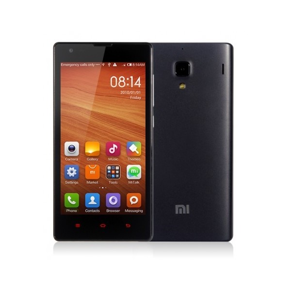

It's been a while I have been using Xiaomi Redmi 1S and I have a confession to make. It's a powerful product with bad design.

I have used a Moto E and a Nexus 5 earlier but never complained on this aspect. There are various points where Redmi falls flat. I know it's a super cheap phone but that does not prevent Xiomi from making it usable.

## Size

It's a big phone. Bigger than it should be. It's 5.39 inches tall and sports a 4.7 inch screen. Compare that to Nexus 5 which has a 5 inch display but has just about the same (5.43 inches) length. The moment you get the phone out of the box, you know you didn't expect it to be this big. It's also pretty thick. At 0.39 inches, you feel like you are holding a piece of brick.

FYI - I don't have small hands!

## Weight

It's heavy. Specially if you come from a Nexus 5 background, you can feel the pain. Overall, the size and the weight, combined, makes the phone look like a beast when it should have a posture of a smartphone made for low-end market, for general public.

## Ergonomics

You won't find the phone comfortable for little things you do. Try this. Try composing a message while you are sleeping. I am sure after a few letters it's going to bang your head and it WILL hurt. Lie down and hold it for a moment. It's going to make your wrist irritated. The curves on the sides make it easy for the phone to slip. I found it bigger for my pocket than I had expected.

## Bezels & Buttons

If you see, there is a lot of space around the screen which I feel is way too much. If you get your hands on the device, you will feel the same. Below the screen you have almost an inch of space just to have the capacitive touch buttons which is insane! What's more frustrating is that the touch buttons don't glow. I often find myself hitting the back or home button twice or thrice to make sure I get it right. With lights off, there's really no way you can see the buttons. I also find myself often hitting the volume rocker when I am actually looking for the power button. Frustrating.

## The Heating Problem

[I am not the only person complaining about it](https://www.google.com/?gws_rd=ssl#q=redmi+1s+overheat). [They have released an update](http://en.miui.com/thread-53432-1-1.html) which claims to solve the issue but I don't see a difference. The phone gets heated up with just 15 minutes of a low-end game play or while it's getting charged. I dare you take it to your ears for a call while it's getting charged.

From the build perspective, I am *guessing* the processor is placed somewhere in the upper half of the phone near the speaker. So when it heats, making phone calls become really difficult.

## Summary

It's not always about getting the best of hardware at a cheaper price. The more you use the phone for the little things you do on a daily basis, you need the phone to help you accomplish the task. The Redmi 1S feels like an obstacle there.
